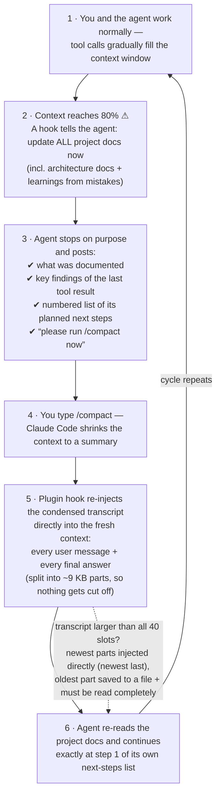

# context-cycle

A Claude Code **plugin** that makes sure long agent sessions never lose knowledge to context compaction:

- **`cycle-context` skill** — import previous agent sessions (Claude Code CLI, **Claude Desktop** local coding sessions and **claude.ai/code remote sessions** from Desktop's cache on macOS, and Codex CLI) into the current conversation as *condensed* context: the user's messages, the main agent's **progress notes** (its narration between tool calls) and **final answer** per turn, and every **subagent's result** — the summary the main agent received plus the subagent's **full report**, labeled with the subagent's real name. No tool calls, tool results, code edits or thinking. An 18 MB session file collapses to well under 10% of its size.
- **Pre-compaction documentation checkpoint** (PostToolUse hook) — when the context crosses 80% of the effective window, the agent is instructed to update all project documentation (incl. architecture docs and learnings from mistakes), then stop with a numbered next-steps list and ask you to run `/compact`. Also available **on demand at any context level** as the `/cycle-checkpoint` skill — same checkpoint, and it suppresses the then-redundant automatic reminder for the current cycle.
- **Post-compaction context restore** (SessionStart hook) — after every compaction, the agent is instructed to ask you (question card) which detail level to restore, with token estimates per level, and then imports exactly that from the session file on disk — plus an instruction to re-read all project docs. The injection is **chunked** (40 parallel hook slots à ~9 KB) because Claude Code silently swaps any single hook output above ~10–12k chars for a file reference the agent would have to read itself; chunking injects up to ~360 KB directly with no Read step. If a transcript is even larger, the **newest content is always injected** (chronological, newest last) and only the oldest part goes to a file with a read-completely instruction.

Everything runs locally (Python 3, stdlib only, no dependencies). Nothing leaves your machine.

## How it works



The trick behind step 5: the condensed extract keeps exactly two things — **your messages** and the agent's **final answers**. Because the agent writes its plan and the relevant tool findings into its *last answer* (step 3), that answer survives compaction and lands back in context automatically. No knowledge is lost, and the agent never has to (incompletely) re-read anything itself.

> 📖 **[The Context Cycle](docs/context-cycle.md)** — full documentation with detailed flow and sequence diagrams, design rationale, and limitations.

## Installation

```
/plugin marketplace add hafnera/context-cycle
/plugin install context-cycle@hafnera
```

That's it — the skill and both hooks are active in all projects (new sessions pick them up automatically). Requires `python3` on the PATH; developed and tested on macOS, should work on Linux, **Windows only inside WSL**.

To update later: `/plugin` → Manage plugins → update, or `claude plugin update context-cycle@hafnera` on the CLI.

To develop or test from a local checkout instead:

```
/plugin marketplace add /path/to/context-cycle
```

## Using the skill

Just phrase it naturally in any session:

- "Import the session from yesterday in project X as context"
- "Load the Codex session where we built the sankey widget"
- "Use cycle-context on the current session so you know again what this session is about" (great right after a compaction)
- or explicitly: `/cycle-context`

Claude lists matching sessions **grouped by repo/project** (with last-activity date and the estimated token size of the condensed transcript), picks the right one (or asks), imports it, and confirms what was imported — always including the import size: `Imported context: ~X.Xk tokens ≈ Y% of the …-token context window`.

**Detail level is your choice:** before importing, the agent asks you via a question card which parts to include — Full (user messages, agent notes, final answers, subagent summaries + full reports), without subagent full reports, final answers only (no notes, subagent summaries only), or minimal (no notes, no subagents). The agent never reduces on its own; `--last N`/`--max-chars N` are likewise only used on your explicit instruction. After a compaction the hook does not inject anything unasked: it injects a short instruction with the token estimates of all four levels, the agent asks you via the question card, then imports the level you chose. (Set `RESTORE_MODE = "full"` in `on_compact.py` for the old unasked full injection.)

## Using the extractor as a CLI

```bash
# Sessions of the current project (Claude Code + Codex)
python3 skills/cycle-context/scripts/extract_session.py list

# Across all projects, filtered by keyword
python3 skills/cycle-context/scripts/extract_session.py list --all-projects --grep "sankey"

# Condensed transcript of one session (id prefix is enough)
python3 skills/cycle-context/scripts/extract_session.py extract f4c4d603 --all-projects

# The currently running session of this project (e.g. after auto-compaction)
python3 skills/cycle-context/scripts/extract_session.py extract --current
```

Key options: `--agent claude|desktop|remote|codex|all`, `--project PATH`, `--all-projects`, `--grep TEXT`, `--current`, `--last N`, `--max-chars N`, `--final-only` / `--no-subagent-reports` / `--no-subagents` (detail levels; the skill asks the user which one via a question card), `--json`, `--path FILE`, `-o FILE`.

## What the parser keeps and drops

- **Structure per turn:** `USER MESSAGE` → `SUBAGENT` blocks → `MAIN AGENT` section (🔹 agent notes between tool calls, 💬 user interjections written while the agent worked, ✅ final answer); a second answer without a new user message is marked as a continuation.
- **Kept:** real user messages; the main agent's progress notes and the final answer of each turn; subagent blocks (`🧭 Subagent «name»`) with the result as received by the main agent and, when it is more than that summary, the subagent's full report — read from its `SubagentHandback` message, its own transcript (`<session>/subagents/agent-*.jsonl` for CLI/Desktop, `parent_tool_use_id` entries in cloud streams) or a locally persisted `tool-results/*.txt` file; Workflow-tool runs (`subagents/workflows/<run>/`) as one block per run with the workflow's result plus every workflow agent's report (its `StructuredOutput` JSON or final text) grouped by phase; carried-over compact summaries; image markers (`[image attached]`).
- **Kept as one-line markers:** slash commands (`⌘ User ran: /model …`), stop-hook follow-ups, background-task completions and interruptions (`⚙ …`) — they remain as turn boundaries so the *correct* final answer is selected per turn.
- **Duplicates are removed:** resumed sessions re-append history into the same file; exact `uuid` duplicates are dropped so nothing appears twice.
- **Rewound branches are removed:** after a `/rewind` (cloud: recorded as a rewind event; CLI: a fork of two user messages under one parent) the abandoned branch is dropped so the transcript reflects the conversation as it actually continued.
- **Dropped:** `tool_use`/`tool_result`, thinking, background-task completion notices, subagent tool traffic, system reminders, meta/hook noise, IDE context, Codex `environment_context`/`user_instructions`, API errors, empty sessions.

## Tuning

| Parameter | Where | Default | Effect |
|---|---|---|---|
| `REMIND_FRACTION` / env `DOC_REMINDER_FRACTION` | `pre_compact_docs_reminder.py` | `0.8` | Fraction of the window that triggers the docs checkpoint |
| `RESET_FRACTION` | `pre_compact_docs_reminder.py` | `0.6` | Re-arm threshold after compaction |
| `autoCompactWindow` | `~/.claude/settings.json` | unset (= model window) | Basis for both auto-compact and the checkpoint threshold, when set |
| `LAST_USER_TURNS` / `MAX_CHARS_PER_MESSAGE` | `on_compact.py` | `None` (= everything) | Optional bounds for the post-compact re-injection |

The threshold basis is `autoCompactWindow` **if set**, otherwise the model window (1M for `[1m]` models, 200k otherwise). The injected message always names the basis it used. If the measured usage is larger than that guess (e.g. the settings model string has no `[1m]` suffix but the session runs with 1M), a 1M window is inferred — the message then says so.

## Notes

- **Claude Desktop sessions (macOS):** Desktop's *local* coding sessions are supported (`[desktop]` in the list, titled as in the Desktop app). Desktop only stores metadata itself (`~/Library/Application Support/Claude/claude-code-sessions/**/local_*.json`); the transcript is the matching `<cliSessionId>.jsonl` under `~/.claude/projects`. *Remote* claude.ai/code sessions (`session_…` ids running in cloud sandboxes) are fetched **completely** from the Anthropic API (`/v1/code/sessions/<id>/events`, paginated back to the first event) with the logged-in CLI's OAuth token — no compromise on history. Listed as `[remote]` with `--all-projects`/`--agent remote` (metadata-only rows for speed), addressable by `session_…` or `cse_…` id. If the API is unavailable (offline, logged out), Desktop's IndexedDB cache serves as fallback — it holds only the last ~2.7 MB of events per session (`headCut`, flagged in the extract). The extract's `Source:` line says which path was used.
- **Transcript retention:** Claude Code deletes CLI transcripts after `cleanupPeriodDays` (default 30!). For a complete long-term history set it high in `~/.claude/settings.json`, e.g. `"cleanupPeriodDays": 3650`.
- **Windows:** works only inside **WSL**. Native Windows is not supported yet (the hooks rely on `python3` and `/tmp`).

- **How the 80% is measured (and why it may differ from the UI):** the hook reads the latest *main-context* usage block from the session file (subagent/sidechain usage is ignored — it describes the subagent's own, much smaller context) and compares it against the **raw** window (`autoCompactWindow` if set, else the model window). Claude Code's own context display measures against the **auto-compact point** instead, so its percentage runs ahead — the UI can show ~90% while the raw measure is at ~78%. The hook fires at raw 80%, which is still comfortably before auto-compact (~90%+). If you want it aligned closer to the UI feeling, lower `REMIND_FRACTION` (e.g. `0.75`).
- Silent hook runs leave no trace in the transcript — below the threshold the reminder produces no output by design. Proof of life after a compaction are the `Recovered session context — part i/M` blocks.
- Sessions marked `*ACTIVE*` in the list are most likely the currently running one.
- Codex titles come from `~/.codex/session_index.jsonl` (thread names), Claude titles from the session's `ai-title` entries; fallback is the first user message.
- Archived Codex sessions (`~/.codex/archived_sessions`) are not scanned currently.
- The agent cannot trigger `/compact` itself (no such tool; hooks can't either) — that's why the checkpoint ends with a stop + a request to you. If you don't compact manually, auto-compact at ~90% is the fallback.
