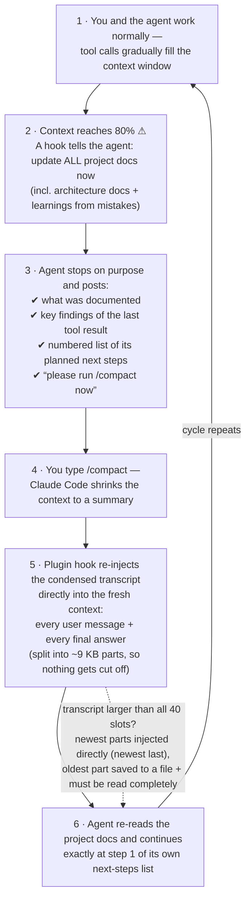

# context-cycle

A Claude Code **plugin** that makes sure long agent sessions never lose knowledge to context compaction:

- **`cycle-context` skill** — import previous local agent sessions (Claude Code **and** Codex CLI) into the current conversation as *condensed* context: only the user's messages and each turn's **final answer** — no tool calls, tool results, code edits, intermediate steps or thinking. An 18 MB session file collapses to ~70 KB of readable context.
- **Pre-compaction documentation checkpoint** (PostToolUse hook) — when the context crosses 80% of the effective window, the agent is instructed to update all project documentation (incl. architecture docs and learnings from mistakes), then stop with a numbered next-steps list and ask you to run `/compact`. Also available **on demand at any context level** as the `/cycle-checkpoint` skill — same checkpoint, and it suppresses the then-redundant automatic reminder for the current cycle.
- **Post-compaction context restore** (SessionStart hook) — after every compaction, the full condensed transcript is re-injected automatically, together with an instruction to re-read all project docs and a token-size report. The injection is **chunked** (40 parallel hook slots à ~9 KB) because Claude Code silently swaps any single hook output above ~10–12k chars for a file reference the agent would have to read itself; chunking injects up to ~360 KB directly with no Read step. If a transcript is even larger, the **newest content is always injected** (chronological, newest last) and only the oldest part goes to a file with a read-completely instruction.

Everything runs locally (Python 3, stdlib only, no dependencies). Nothing leaves your machine.

## How it works



The trick behind step 5: the condensed extract keeps exactly two things — **your messages** and the agent's **final answers**. Because the agent writes its plan and the relevant tool findings into its *last answer* (step 3), that answer survives compaction and lands back in context automatically. No knowledge is lost, and the agent never has to (incompletely) re-read anything itself.

> 📖 **[The Context Cycle](docs/context-cycle.md)** — full documentation with detailed flow and sequence diagrams, design rationale, and limitations.

## Installation

```
/plugin marketplace add hafnera/context-cycle
/plugin install context-cycle@hafnera
```

That's it — the skill and both hooks are active in all projects (new sessions pick them up automatically). Requires `python3` on the PATH; developed and tested on macOS, should work on Linux, Windows is untested.

To update later: `/plugin` → Manage plugins → update, or `claude plugin update context-cycle@hafnera` on the CLI.

To develop or test from a local checkout instead:

```
/plugin marketplace add /path/to/context-cycle
```

## Using the skill

Just phrase it naturally in any session:

- "Import the session from yesterday in project X as context"
- "Load the Codex session where we built the sankey widget"
- "Use cycle-context on the current session so you know again what this session is about" (great right after a compaction)
- or explicitly: `/cycle-context`

Claude lists matching sessions **grouped by repo/project** (with last-activity date and the estimated token size of the condensed transcript), picks the right one (or asks), imports it, and confirms what was imported — always including the import size: `Imported context: ~X.Xk tokens ≈ Y% of the …-token context window`.

**Full-extract rule:** by default the agent always imports the complete condensed transcript. The limiting options (`--last N`, `--max-chars N`) are only ever used on your explicit instruction, and any limited import is called out explicitly.

## Using the extractor as a CLI

```bash
# Sessions of the current project (Claude Code + Codex)
python3 skills/cycle-context/scripts/extract_session.py list

# Across all projects, filtered by keyword
python3 skills/cycle-context/scripts/extract_session.py list --all-projects --grep "sankey"

# Condensed transcript of one session (id prefix is enough)
python3 skills/cycle-context/scripts/extract_session.py extract f4c4d603 --all-projects

# The currently running session of this project (e.g. after auto-compaction)
python3 skills/cycle-context/scripts/extract_session.py extract --current
```

Key options: `--agent claude|codex|all`, `--project PATH`, `--all-projects`, `--grep TEXT`, `--current`, `--last N`, `--max-chars N`, `--all-text` (all assistant text of a turn instead of only the final answer), `--json`, `--path FILE`, `-o FILE`.

## What the parser keeps and drops

- **Kept:** real user messages, the final assistant answer of each turn, carried-over compact summaries, image markers (`[image attached]`).
- **Kept as one-line markers:** slash commands (`⌘ User ran: /model …`), stop-hook follow-ups, background-task completions and interruptions (`⚙ …`) — they remain as turn boundaries so the *correct* final answer is selected per turn.
- **Dropped:** `tool_use`/`tool_result`, thinking, subagent sidechains, system reminders, meta/hook noise, IDE context, Codex `environment_context`/`user_instructions`, API errors, empty sessions.

## Tuning

| Parameter | Where | Default | Effect |
|---|---|---|---|
| `REMIND_FRACTION` / env `DOC_REMINDER_FRACTION` | `pre_compact_docs_reminder.py` | `0.8` | Fraction of the window that triggers the docs checkpoint |
| `RESET_FRACTION` | `pre_compact_docs_reminder.py` | `0.6` | Re-arm threshold after compaction |
| `autoCompactWindow` | `~/.claude/settings.json` | unset (= model window) | Basis for both auto-compact and the checkpoint threshold, when set |
| `LAST_USER_TURNS` / `MAX_CHARS_PER_MESSAGE` | `on_compact.py` | `None` (= everything) | Optional bounds for the post-compact re-injection |

The threshold basis is `autoCompactWindow` **if set**, otherwise the model window (1M for `[1m]` models, 200k otherwise). The injected message always names the basis it used.

## Notes

- Sessions marked `*ACTIVE*` in the list are most likely the currently running one.
- Codex titles come from `~/.codex/session_index.jsonl` (thread names), Claude titles from the session's `ai-title` entries; fallback is the first user message.
- Archived Codex sessions (`~/.codex/archived_sessions`) are not scanned currently.
- The agent cannot trigger `/compact` itself (no such tool; hooks can't either) — that's why the checkpoint ends with a stop + a request to you. If you don't compact manually, auto-compact at ~90% is the fallback.
