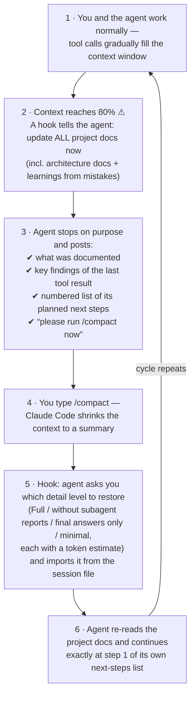

# context-cycle

A Claude Code **plugin** that makes sure long agent sessions never lose knowledge to context compaction — and lets you pull any earlier session (Claude Code CLI, Claude Desktop, claude.ai/code cloud sessions, Codex CLI) into the current conversation as clean, condensed context.

> 📖 **[The Context Cycle](docs/context-cycle.md)** — how the pieces close the loop, with diagrams, design rationale and limitations.

Everything runs locally (Python 3, stdlib only, no dependencies). The only network access is the optional read of your own claude.ai/code cloud sessions through the Anthropic API, using the token of your existing Claude Code login.

## What you get

- **`/cycle-context` skill** — import a previous session as condensed context: your messages, the main agent's progress notes and final answer per turn, and every subagent's result (summary + full report, labeled with the subagent's real name). No tool calls, tool results, code edits or thinking. You choose the detail level via a question card. A 25 MB session file becomes a readable transcript of a few hundred KB (or a few dozen KB at lower levels).
- **`/cycle-checkpoint` skill** — the documentation checkpoint on demand: update all project docs (incl. architecture docs and learnings from mistakes), then stop with a numbered next-steps list and ask you to `/compact`.
- **Pre-compaction checkpoint hook** (PostToolUse) — at 80% context usage the agent is told to run exactly that checkpoint by itself.
- **Post-compaction restore hook** (SessionStart, `compact`) — right after a compaction the agent is told to ask you which detail level to restore (with token estimates per level) and to import that from the session file on disk.

## How it works



The trick behind step 5: the condensed extract keeps the conversation — your messages and the agent's answers — but no tool traffic. Because the agent writes its plan and the relevant tool findings into its *last answer* (step 3), that answer survives compaction and lands back in context.

## Installation

```
/plugin marketplace add hafnera/context-cycle
/plugin install context-cycle@hafnera
```

Both skills and both hooks are then active in all projects (new sessions pick them up automatically). Requires `python3` on the PATH. macOS is the developed and tested platform; Linux should work; **Windows only inside WSL**.

Updating: `claude plugin update context-cycle@hafnera` (or `/plugin` → Manage plugins). Maintainers: bump `version` in `.claude-plugin/plugin.json` on every change, otherwise the updater reports "already at latest".

## Using the skill — you don't need session ids

Just describe the session; the agent finds it:

- "Import the session from yesterday in project X as context"
- "Load the Codex session where we built the sankey widget"
- "Use cycle-context on the current session so you know again what this session is about" (great right after a compaction)
- or explicitly: `/cycle-context` followed by a description

The agent lists matching sessions **grouped by repo/project** with title, last-activity date and the estimated token size, picks the one that matches your description or shows you a short list to choose from, asks for the **detail level**, imports, and confirms what was imported including the import size (`Imported context: ~X.Xk tokens ≈ Y% of the …-token context window`).

### Detail levels (asked via question card before every import)

| Level | Contains |
|---|---|
| **Full** (recommended) | your messages, the agent's notes between tool calls, final answers, subagent summaries **and** full reports |
| Without subagent full reports | as Full, but subagent blocks keep only the summary the main agent received |
| Final answers only | your messages, final answers, subagent summaries — no agent notes |
| Minimal | your messages and final answers only |

The agent never reduces on its own; `--last N` / `--max-chars N` are likewise only used on your explicit instruction.

### What the extract looks like

Per user turn: `## 👤 USER MESSAGE` → `### 🧭 SUBAGENT «name»` blocks (summary as received, then "Here is the full report …", closed by an end marker) → `### 🤖 MAIN AGENT` section with `🔹 Agent note (time)` paragraphs, `💬 USER INTERJECTION` for messages you typed while the agent was working, and `#### ✅ MAIN AGENT — FINAL ANSWER`. If the agent answered, then continued after subagent reports arrived, the earlier answer is labeled as such. Slash commands (`⌘`), interruptions and hook-triggered follow-ups (`⚙`) stay as one-line markers. Headings inside embedded content are demoted so they can never be mistaken for the transcript's structure. A legend at the top names the detail level.

## Session sources

| Source | Where it is read from | Notes |
|---|---|---|
| Claude Code CLI (incl. Cursor/IDE sessions) | `~/.claude/projects/<project>/<id>.jsonl` (+ `<id>/subagents/`) | append-only; complete |
| Claude Desktop local sessions (macOS) | metadata in `~/Library/Application Support/Claude/claude-code-sessions/**/local_*.json`, transcript = the matching CLI jsonl | listed as `[desktop]` with the Desktop title |
| claude.ai/code cloud sessions | Anthropic API `/v1/code/sessions/<id>/events`, paginated back to the first event, with your CLI login token | listed as `[remote]` (`--all-projects` or `--agent remote`); `session_…` or `cse_…` ids; Desktop's IndexedDB cache is the offline fallback (tail-only) |
| Codex CLI | `~/.codex/sessions/**/rollout-*.jsonl` | titles from `session_index.jsonl` |

**Transcript retention:** Claude Code deletes CLI transcripts after `cleanupPeriodDays` (default 30). For a complete long-term history set it high in `~/.claude/settings.json`, e.g. `"cleanupPeriodDays": 3650`.

## What the parser keeps and drops

- **Kept:** real user messages; user interjections (queued while the agent worked); the main agent's progress notes and final answer per turn; subagent blocks — Agent-tool subagents (`subagents/agent-*.jsonl`, cloud `parent_tool_use_id` entries) with the received summary and the full report (`SubagentHandback` message, own transcript, or a locally persisted `tool-results/*.txt`), resumed subagents split per invocation; Workflow-tool runs (`subagents/workflows/<run>/`) as one block per run with the workflow's result and every workflow agent's report (their `StructuredOutput` JSON rendered as Markdown), grouped by phase; carried-over compact summaries; image markers.
- **Removed:** `tool_use`/`tool_result`, thinking, background-task completion notices, subagent tool traffic, system reminders, hook/meta noise, IDE context, synthetic worker events, API errors, duplicate entries re-appended by resumes, and **rewound branches** (cloud: rewind events; CLI: a fork of two user messages under one parent — the abandoned branch is dropped).

## CLI reference

```bash
X=~/.claude/plugins/cache/hafnera/context-cycle/<version>/skills/cycle-context/scripts/extract_session.py
python3 $X list                                   # sessions of the current project
python3 $X list --all-projects --grep "sankey"    # everywhere, by keyword
python3 $X list --agent remote                    # your claude.ai/code cloud sessions
python3 $X extract <id-prefix> --all-projects     # condensed transcript to stdout
python3 $X extract --current -o ctx.md            # the running session of this project
python3 $X extract <id> --final-only --no-subagent-reports   # a lower detail level
```

Options: `--agent claude|desktop|remote|codex|all`, `--project PATH`, `--all-projects`, `--grep TEXT`, `--current`, `--path FILE`, `--no-subagent-reports`, `--no-subagents`, `--final-only`, `--last N`, `--max-chars N`, `--json`, `-o FILE`. Every extract prints `Imported context: ~Xk tokens ≈ Y% …` on stderr.

## Hooks and tuning

| Parameter | Where | Default | Effect |
|---|---|---|---|
| `REMIND_FRACTION` / env `DOC_REMINDER_FRACTION` | `pre_compact_docs_reminder.py` | `0.8` | fraction of the window that triggers the checkpoint |
| `RESET_FRACTION` | `pre_compact_docs_reminder.py` | `0.6` | re-arm threshold after compaction |
| `RESTORE_MODE` | `on_compact.py` | `"ask"` | `"ask"` injects the detail-level instruction; `"full"` injects the whole transcript unasked (chunked) |
| `autoCompactWindow` | `~/.claude/settings.json` | unset | basis for auto-compact and the checkpoint threshold when set |

The checkpoint threshold is measured from the latest main-context usage block in the session file (subagent usage ignored) against the raw window — `autoCompactWindow` if set, else the model window (1M for `[1m]` models, 200k otherwise; a larger measured usage infers 1M). Claude Code's own display measures against the auto-compact point, so it shows a higher percentage.

## Tests

```bash
python3 -m unittest discover -s tests -v
```

Synthetic sessions cover tool calls, progress notes, interjections, rewinds, duplicates, sidechains, Agent-tool subagents incl. a resumed invocation, Workflow runs, background tasks, slash commands, Codex rollouts, the Desktop cache decoder (V8 + Snappy) and both hooks. The structural invariants (per-turn order, no noise leaks, identical user counts and monotonic sizes across detail levels) are asserted there and were additionally validated against 20+ MB real sessions.

## Notes and limits

- Silent hook runs leave no trace in the transcript; proof of life after a compaction is the injected restore instruction.
- Cloud sessions need the CLI login token (macOS Keychain or `~/.claude/.credentials.json`); offline, Desktop's cache holds only the last ~2.7 MB per session.
- Workflow results in task notifications are truncated by Claude Code at ~8k chars; the extract says so and relies on the per-agent reports, which are complete.
- Secrets pasted into a session are part of its transcript and therefore of the extract.
