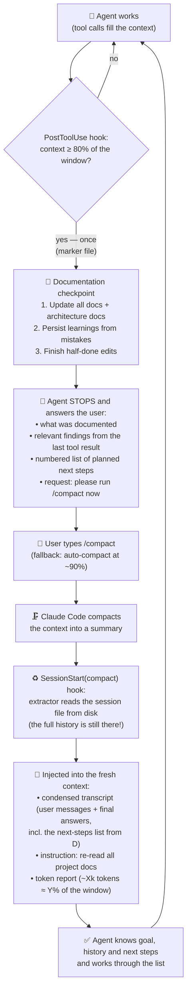
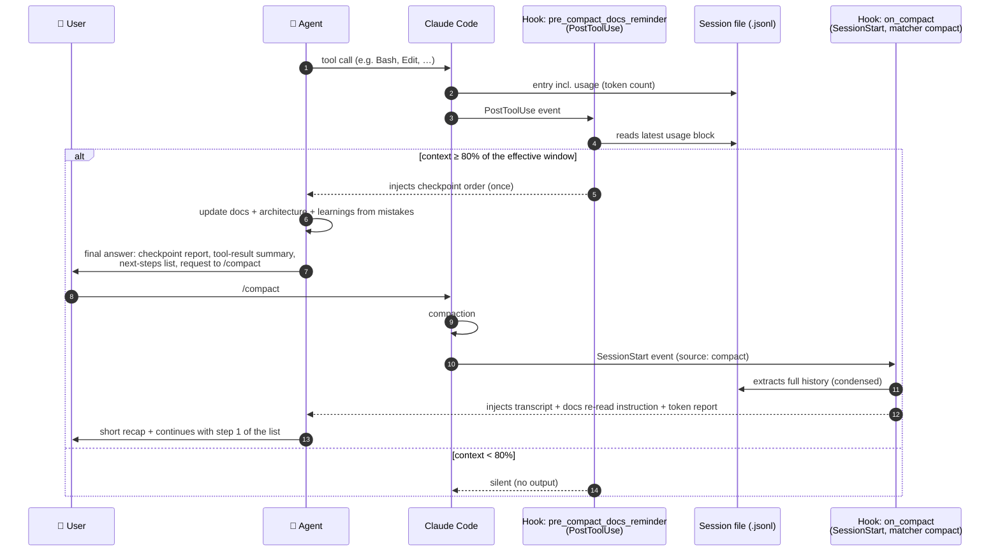

# The Context Cycle

How this plugin makes sure that **no knowledge is lost to context compaction** in long Claude Code sessions.

## The problem

When an agent's context window fills up, Claude Code compacts the conversation into a summary. Lost in that process: the original wording of your requests, details from final answers, tool-call results — and everything the agent knew but had not (yet) written down.

## The solution: three components, one cycle

| Component | Type | File | Job |
|---|---|---|---|
| Extractor | CLI script | [`skills/session-context/scripts/extract_session.py`](../skills/session-context/scripts/extract_session.py) | Distills session files (Claude Code + Codex) down to user messages + final answers |
| `session-context` skill | Plugin skill | [`skills/session-context/SKILL.md`](../skills/session-context/SKILL.md) | Manual import of sessions as context; also for the running session (`--current`) |
| Docs-checkpoint reminder | `PostToolUse` hook | [`skills/session-context/hooks/pre_compact_docs_reminder.py`](../skills/session-context/hooks/pre_compact_docs_reminder.py) | Detects the 80% threshold, orders a documentation checkpoint + orderly stop |
| Context restore | `SessionStart(compact)` hook | [`skills/session-context/hooks/on_compact.py`](../skills/session-context/hooks/on_compact.py) | After every compaction, injects the full condensed transcript + docs re-read instruction |

Both hooks are registered automatically by the plugin ([`hooks/hooks.json`](../hooks/hooks.json)) and apply in all projects.

## The cycle at a glance

**The trick in step D:** the extraction keeps exactly two things — user messages and **final answers**. By writing its plan and the relevant tool findings into its last answer, the agent makes them compaction-proof: exactly that answer is re-injected in step H.

## The flow as a sequence diagram

## Injection mechanics: why the restore is chunked

Claude Code silently replaces any single hook output larger than **~10–12k characters** (empirically measured; undocumented) with a 2 KB preview plus a file path — the agent would then have to Read the file itself, which in practice happens incompletely. That is why `hooks/hooks.json` registers the restore script **40 times** (`--part i --parts 40`): every part deterministically extracts the same transcript and prints only its own ≤ 9k-character slice, labeled `part i/M` (parts may arrive out of order — hooks run in parallel — so the labels plus a small stagger sleep keep them reassemblable). This injects up to ~360 KB (~90k tokens) of transcript **directly into context, with no Read step**.

**Overflow policy (newest wins):** if the transcript needs more than the 40 slots, the **most recent** content is always injected directly, in chronological order with the newest parts last. Slot 1 becomes an overflow notice; the oldest chunks (including the session's original request) are saved to `/tmp/claude-session-restore-<session-id>.md` with a mandatory read-it-completely instruction.

## Key design decisions

1. **Why not a PreCompact hook?** `PreCompact` fires when compaction is already underway — its output never reaches the model, and there is no token headroom left for documentation work. Hence the 80% approximation via `PostToolUse` with a real token measurement from the session file's usage block.
2. **Why does the agent stop instead of continuing?** The agent verifiably cannot trigger `/compact` itself (no SlashCommand tool exists, and hooks can't trigger compaction either — see the [tools reference](https://code.claude.com/docs/en/tools-reference.md)). The orderly stop with a next-steps list makes the compaction moment non-critical and puts the user in control.
3. **Why does the next-steps list survive?** The `.jsonl` session file on disk is append-only and keeps the full history even after compaction. The extractor distills it into user messages + final answers — including the last answer with the list.
4. **Threshold basis:** `autoCompactWindow` from `~/.claude/settings.json` **if set**, otherwise the model window (1M for `[1m]` models, 200k otherwise). The injected message always names the basis it used.
5. **Once-only & re-arm:** a marker file `/tmp/claude-doc-reminder-<session-id>` prevents repeat spam. When the context falls below 60% of the threshold after compaction, the marker is removed — the cycle is armed for the next round.
6. **Full extracts by default:** neither the skill nor the hooks truncate on their own (`--last`/`--max-chars` only on explicit user instruction; full-extract rule in SKILL.md). Every import reports its size: `Imported context: ~Xk tokens ≈ Y% of the …-token context window`.

## Tuning

| Parameter | Where | Default | Effect |
|---|---|---|---|
| `REMIND_FRACTION` / env `DOC_REMINDER_FRACTION` | `pre_compact_docs_reminder.py` | `0.8` | Fraction of the window that triggers the checkpoint |
| `RESET_FRACTION` | `pre_compact_docs_reminder.py` | `0.6` | Below this × threshold the marker re-arms |
| `autoCompactWindow` | `~/.claude/settings.json` | unset (= model window) | Shrinks the effective window for auto-compact **and** the checkpoint threshold |
| `LAST_USER_TURNS` / `MAX_CHARS_PER_MESSAGE` | `on_compact.py` | `None` (= everything) | Optional bounds for the re-injection |

## Limitations

- The skill's `--current` mode identifies the running session via the most recently written file (mtime) — with two parallel sessions in the same project, specify the session id instead. (The hooks are unaffected: they receive the exact `transcript_path` from the harness.)
- Tool results only survive compaction to the extent the agent summarizes them into its final checkpoint answer (hence the mandatory last-tool-result summary).
- If the user never compacts manually, auto-compact at ~90% is the fallback — the checkpoint has long been written by then.
