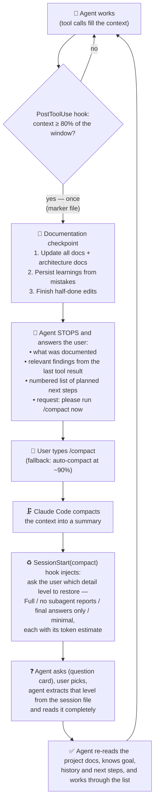

# The Context Cycle

How this plugin makes sure that **no knowledge is lost to context compaction** in long Claude Code sessions, and how earlier sessions become clean context for a new one.

## The problem

When an agent's context window fills up, Claude Code compacts the conversation into a summary. Lost in that process: the original wording of your requests, details from answers, the reports of subagents — and everything the agent knew but had not written down.

## Components

| Component | Type | File | Job |
|---|---|---|---|
| Extractor | CLI script | [`skills/cycle-context/scripts/extract_session.py`](../skills/cycle-context/scripts/extract_session.py) | Discovers sessions (CLI, Desktop local, cloud, Codex) and distills them into the structured transcript |
| Desktop cache decoder | module | [`skills/cycle-context/scripts/v8idb.py`](../skills/cycle-context/scripts/v8idb.py) | V8 structured-clone + Snappy reader for Claude Desktop's IndexedDB (offline fallback for cloud sessions) |
| `cycle-context` skill | plugin skill | [`skills/cycle-context/SKILL.md`](../skills/cycle-context/SKILL.md) | Finds the session from a description, asks the detail level, imports, confirms with size |
| `cycle-checkpoint` skill | plugin skill | [`skills/cycle-checkpoint/SKILL.md`](../skills/cycle-checkpoint/SKILL.md) | The documentation checkpoint on demand |
| Checkpoint reminder | `PostToolUse` hook | [`skills/cycle-context/hooks/pre_compact_docs_reminder.py`](../skills/cycle-context/hooks/pre_compact_docs_reminder.py) | Measures context usage after each tool call; at 80% orders the checkpoint once |
| Restore instruction | `SessionStart(compact)` hook | [`skills/cycle-context/hooks/on_compact.py`](../skills/cycle-context/hooks/on_compact.py) | After compaction: instruct the agent to ask the detail level (with estimates) and import |
| Tests | unittest | [`tests/test_extract.py`](../tests/test_extract.py) | Synthetic sessions with every special case; structural invariants |

Hooks are registered by the plugin ([`hooks/hooks.json`](../hooks/hooks.json)) and apply in all projects.

## The cycle

**Why the next-steps list survives:** the extractor keeps user messages and the agent's answers. By writing its plan and the relevant tool findings into its last answer (step D), the agent makes them compaction-proof.

## The transcript structure

Per user turn, in this order:

1. `## 👤 USER MESSAGE — time` — the user's message.
2. `### 🧭 SUBAGENT «name» — result as received by the main agent` — one block per subagent result of this turn: the summary the main agent received, then `Here is the full report from subagent «name»:` with the complete report, closed by `*(end of subagent «name»)*`. Workflow runs render as `### 🧭 Workflow: 
` with the workflow's result (JSON rendered as Markdown, failures listed) and the reports of all workflow agents grouped by phase.
3. `### 🤖 MAIN AGENT — response to the user message above` — `🔹 Agent note (time)` paragraphs (the agent's narration between tool calls), `💬 USER INTERJECTION (time)` for messages typed while the agent was busy, `#### ✅ MAIN AGENT — FINAL ANSWER`. An answer after which the agent continued (typically when background-agent reports arrived) is labeled `ANSWER (turn ended here; the agent continued afterwards …)`.

Markers between turns: `*⌘ User ran:* /command`, `*⚙ [user interrupted]*`, `*⚙ [hook: …]*`. Carried-over compact summaries appear as `### 📋 …`. Headings inside embedded content are demoted to level 5–6 and horizontal rules neutralized. The legend at the top names the detail level.

## Sources and how they are read

- **Claude Code CLI / IDE:** `~/.claude/projects/<munged cwd>/<session>.jsonl` — one content block per line, a **tree** (`uuid`/`parentUuid`). Subagents: `<session>/subagents/agent-<id>.jsonl` + `.meta.json` (`agentType`, `description`, `toolUseId`); Workflow runs: `<session>/subagents/workflows/<run>/`. Mid-turn user messages: `attachment` entries of type `queued_command`. Persisted tool outputs: `<session>/tool-results/*.txt`.
- **Claude Desktop local sessions:** metadata JSON (`title`, `model`, `cwd`, `cliSessionId`) under `~/Library/Application Support/Claude/claude-code-sessions/`; the transcript is the CLI jsonl named after `cliSessionId`.
- **claude.ai/code cloud sessions:** `GET https://api.anthropic.com/v1/code/sessions` (list, `next_cursor`) and `/v1/code/sessions/<id>/events?cursor=&limit=100` (newest first, back to sequence 1) with the CLI OAuth token (`Claude Code-credentials` in the Keychain / `~/.claude/.credentials.json`, headers `anthropic-version` + `anthropic-beta: oauth-2025-04-20,claude-code-20250219`). Subagent events carry `parent_tool_use_id`, `subagent_type`, `task_description`; background agents hand back via a `SubagentHandback` tool call and a synthetic `<agent-message>` user event; rewinds are `control_response` events with `rewound`/`precedingAssistantUuid`; `result` events mark turn ends. Bridged local sessions (`environment_kind: bridge`) are skipped (they are local files). Offline fallback: Desktop's IndexedDB blobs (`https_claude.ai_0.indexeddb.blob`), V8 structured clone inside Snappy, tail-only (~2.7 MB, `headCut`).
- **Cloud sessions continued locally:** when a claude.ai/code session is taken over in the IDE/CLI ("(fork)"), Claude Code writes the cloud history into the new local jsonl as a replay — entries with `version: "1.0"`, `userType: "unknown"`, fresh uuids and timestamps, but the original API message ids and `tool_use` ids. The cloud's subagent events are not replayed, and nothing in the file names the cloud session (the `bridge-session` entry carries the *new* bridge id). The extractor therefore searches the account's non-bridge cloud sessions created before the takeover, closest activity first, and compares each one's oldest 100 events with the replay's ids (one call each, at most 12 candidates); the first hit is cached per local session under `~/.cache/context-cycle/`, as are the fetched events. The extract then uses the cloud stream (rewinds applied, cut at the last event the replay contains, plus the events of agents still running) for the history up to the takeover and the local file for everything after.
- **Codex CLI:** `~/.codex/sessions/**/rollout-*.jsonl` (`session_meta`, `response_item` messages); titles from `session_index.jsonl`.

## Key design decisions

1. **Why not a PreCompact hook?** `PreCompact` fires when compaction is already underway — its output never reaches the model, and there is no token headroom left. Hence the 80% approximation via `PostToolUse` with a real token measurement from the session file's usage block.
2. **Why does the agent stop instead of continuing?** The agent cannot trigger `/compact` (no such tool; hooks can't either). The orderly stop with a next-steps list makes the compaction moment non-critical and puts the user in control.
3. **Why does the restore ask instead of injecting?** A hook cannot show a question card, and the user decides how much context to spend. The hook therefore injects an instruction plus per-level token estimates; the agent asks and imports. (`RESTORE_MODE = "full"` restores unasked, chunked injection — chunked because Claude Code replaces any hook output above ~10–12k chars with a 2 KB preview and a file path.)
4. **Threshold measurement:** latest main-context usage block (sidechain entries skipped); basis `autoCompactWindow` if set, else the window of the model the session runs on — read from the transcript's newest assistant message, the settings model only as fallback (`[1m]` models and the Claude 5 family → 1M, else 200k; a measured usage above the guess infers 1M). Claude Code's display measures against the auto-compact point, so it runs ahead of this percentage.
5. **Once-only & re-arm:** marker file `/tmp/claude-doc-reminder-<session-id>`; removed when usage falls below 60% of the threshold after a compaction.
6. **Turn model:** a turn ends at a real user message, a `result` event, an interruption, a slash command or a stop-hook prompt — never at a subagent report or background-task notice. Whether a user message is a new turn or an interjection depends on whether the agent's last message ended in a tool call.
7. **Trees, duplicates, rewinds:** exact `uuid` duplicates (resumes re-append history) are removed first; only forks of two *real* user prompts under one parent are treated as rewinds (earlier sibling + descendants dropped). Following a single leaf chain proved to discard legitimate history; `/compact` artifacts must never count as user prompts.
8. **Subagents:** registered from Agent-tool calls, `subagents/` files and in-stream `parent_tool_use_id` entries (user/assistant only — `tool_progress` events carry that id for ordinary tools). Summary = the shortest available text (typically the agent's closing note), report = the longest (hand-back, `SubagentHandback` message, own transcript, persisted file). Resumed agents are split into invocation segments at their resume prompts; the n-th block uses the n-th segment. Background agents are placed when their report arrives, launch/resume confirmations are skipped.
9. **Workflows:** the Workflow tool result names the run's transcript dir; the task notification (user text or queued attachment) carries the result — truncated by Claude Code at ~8k chars, so the extract says so and relies on the complete per-agent `StructuredOutput` reports.
10. **Full extracts by default, levels only by choice:** no truncation on the agent's own judgment; the four levels are strictly nested and monotonic in size.
11. **Continued cloud sessions are stitched, not patched:** instead of injecting cloud subagent events into the local replay, the cloud stream itself (already proven to render correctly, with hand-backs, rewinds and results) supplies the history up to the takeover and the local file the rest. The seam is exact: replay entries are marked (`version: "1.0"`), and the cut point is the last cloud event whose id the replay contains. Listings (`list`) use only cached cloud data so they never wait for the network; a session whose origin cannot be fetched is extracted from the replay with a warning in the header.
12. **The import size refers to the running session's model:** `CLAUDE_CODE_SESSION_ID` (set by Claude Code for Bash commands) locates the running transcript, whose newest assistant message names the model actually in use; `~/.claude/settings.json` can name a different model. The report line says which source was used (`this session` / `from settings`).

## Tuning

| Parameter | Where | Default | Effect |
|---|---|---|---|
| `REMIND_FRACTION` / env `DOC_REMINDER_FRACTION` | `pre_compact_docs_reminder.py` | `0.8` | fraction of the window that triggers the checkpoint |
| `RESET_FRACTION` | `pre_compact_docs_reminder.py` | `0.6` | below this × threshold the marker re-arms |
| `RESTORE_MODE` | `on_compact.py` | `"ask"` | `"ask"` or `"full"` |
| `CHUNK_CHARS`, `STAGGER_SECONDS` | `on_compact.py` | `9000`, `0.15` | chunked injection in `"full"` mode |
| `autoCompactWindow` | `~/.claude/settings.json` | unset | shrinks the effective window for auto-compact **and** the checkpoint threshold |

## Limitations

- `--current` identifies the running session by the most recently written file; with two parallel sessions in the same project, pass the id. Hooks are unaffected (they receive `transcript_path`).
- Cloud sessions need a valid CLI login token; offline, only Desktop's tail-only cache is available.
- Claude Code deletes CLI transcripts after `cleanupPeriodDays` (default 30) — raise it for long-term history.
- Native Windows is unsupported (python3 / `/tmp`); use WSL.
- Plugin hooks are bound when a session starts; a running session keeps the hook scripts of the plugin version it started with until it is restarted.
- The origin search for a continued cloud session is bounded (12 candidates, oldest 100 events each) and needs the CLI login; pass `--cloud-origin` when it fails.
